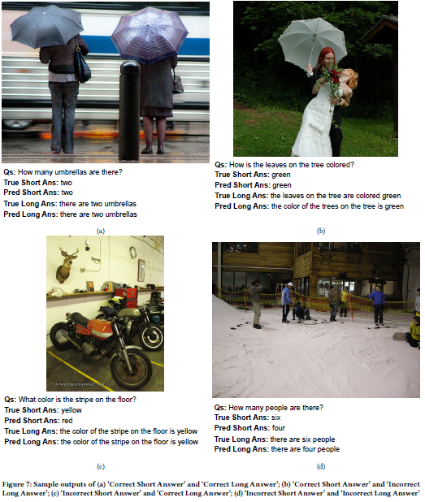

# 📘 S-VQA: Sentence-Based Visual Question Answering

**ICVGIP 2023 (ACM)**\
Full-sentence Visual Question Answering with dataset construction and
multi-task multimodal modeling.

------------------------------------------------------------------------

## 🚀 Motivation

Most Visual Question Answering (VQA) systems formulate answering as a
classification task, producing short responses such as:

> "Man"

However, short answers often lack clarity and semantic richness.\
This work reformulates VQA as a **sentence generation task**, enabling
more descriptive and interpretable responses.

Example:


**Question:** Who is wearing glasses?
- Short answer: *Man*
- Sentence answer: *The man on left is wearing glasses.*

------------------------------------------------------------------------

## 🧠 Key Contributions

### 1️⃣ TDIUC-SVQA Dataset

A sentence-based VQA dataset derived from TDIUC.

-   Full-sentence answers generated using category-specific linguistic
    rules
-   Paraphrase augmentation using PEGASUS
-   Grammar correction using Gramformer
-   Manual validation across categories (\~99% sampled accuracy)

Supported categories include: - Object Presence - Counting - Color -
Scene Recognition - Sentiment Understanding - Positional Reasoning -
Object Recognition - Sport/Activity Recognition

------------------------------------------------------------------------

### 2️⃣ Multi-Task Sentence-Based VQA Models

Three model configurations were benchmarked:

#### 🔹 Baseline: FSVQA-R

-   ResNet-101 image encoder
-   GloVe + LSTM question encoder
-   LSTM decoder for sentence generation

#### 🔹 BUTD-SVQA (Proposed)

-   Bottom-Up Top-Down attention (Faster R-CNN + ResNet-101)
-   Region-level attention over object proposals
-   Multi-task learning:
    -   Short-answer classification loss
    -   Sentence generation loss

#### 🔹 BUTD-AoANet-SVQA (Final Model)

-   Attention-on-Attention (AoA) enhanced decoder
-   Multi-head attention over image features
-   Beam search decoding

------------------------------------------------------------------------

## 📊 Training Setup

-   Optimizer: Adam
-   Epochs: 10
-   Max sentence length: 14 tokens
-   Evaluation Metrics:
    -   BLEU-1 / BLEU-4
    -   ROUGE-L
    -   METEOR
    -   CIDEr
    -   Classification Accuracy

------------------------------------------------------------------------

## 📈 Results (Best Model: BUTD-AoANet-SVQA + Beam Search)

  Metric                    Score
  ------------------------- -------
  Classification Accuracy   0.80
  BLEU-1                    0.90
  BLEU-4                    0.61
  ROUGE-L                   0.91
  METEOR                    0.74
  CIDEr                     6.82

Multi-task learning was critical --- removing classification loss
drastically reduced factual grounding.

------------------------------------------------------------------------

## 🔍 Qualitative Insights

Approximately 71% of validation samples achieved both correct short and
correct long answers.



*Figure adapted from Pathak et al., “S-VQA: Sentence-Based Visual Question Answering,” ICVGIP 2023 (ACM).*

Some semantically correct responses were penalized due to synonym
variation (CIDEr sensitivity), suggesting stronger intrinsic performance
than metrics alone indicate.

------------------------------------------------------------------------

## 🏗️ Architecture Overview

Pipeline:

1.  Extract region-level visual features (Faster R-CNN + ResNet-101)
2.  Encode question (GloVe + LSTM)
3.  Apply Bottom-Up Top-Down attention
4.  Predict short answer (classification head)
5.  Generate full sentence (AoA-enhanced LSTM decoder)

Total Loss = Classification Loss + Generation Loss

------------------------------------------------------------------------

## 🔮 Future Work

-   Multi-relation attention across image, question, and answer tokens
-   Transformer-based decoders
-   Semantic consistency constraints
-   More diverse ground-truth sentence annotations

------------------------------------------------------------------------

## 📄 Citation

``` bibtex
@inproceedings{10.1145/3627631.3627670,
author = {Pathak, Sanchit and Singh, Garima and Anand, Ashish and Guha, Prithwijit},
title = {S-VQA: Sentence-Based Visual Question Answering},
year = {2024},
isbn = {9798400716256},
publisher = {Association for Computing Machinery},
address = {New York, NY, USA},
url = {https://doi.org/10.1145/3627631.3627670},
doi = {10.1145/3627631.3627670},
abstract = {Visual Question Answering (VQA) system responds to a natural language question in context of an image. This problem has been primarily formulated as a classification problem with the answers as the finite number of classes. Thus, the generated response consists of a single word or a short phrase. However, this also limits the linguistic capabilities of such a system. In contrast, this work presents a Sentence-based VQA (S-VQA) which responds to questions with complete sentences as answers. The first contribution of this work is the development of a dataset from the Task Directed Image Understanding Challenge (TDIUC) VQA dataset using natural language rules and pretrained para-phrasers. This new dataset is referred to as TDIUC-SVQA. The second contribution involves the performance evaluation of multiple models on the TDIUC-SVQA dataset. This is performed by using two multi-modal models. The Bottom-Up Top-Down Attention based VQA model is combined with LSTM decoder and Attention-on-Attention Network for answer generation. The proposed models are observed to provide improved results compared to the baseline model.},
booktitle = {Proceedings of the Fourteenth Indian Conference on Computer Vision, Graphics and Image Processing},
articleno = {39},
numpages = {8},
keywords = {AoANet, BUTD, LSTM, S-VQA, TDIUC, VQA},
location = {Rupnagar, India},
series = {ICVGIP '23}
}
```

------------------------------------------------------------------------

## 💡 Why This Project Matters

-   Moves VQA beyond classification
-   Introduces structured dataset construction methodology
-   Demonstrates benefits of multi-task learning
-   Bridges vision-language modeling and natural language generation

------------------------------------------------------------------------

### 📄 Paper

Pathak, S., Singh, G., Anand, A., & Guha, P. (2023).  
**S-VQA: Sentence-Based Visual Question Answering.**  
ICVGIP 2023 (ACM).  
https://doi.org/10.1145/3627631.3627670

